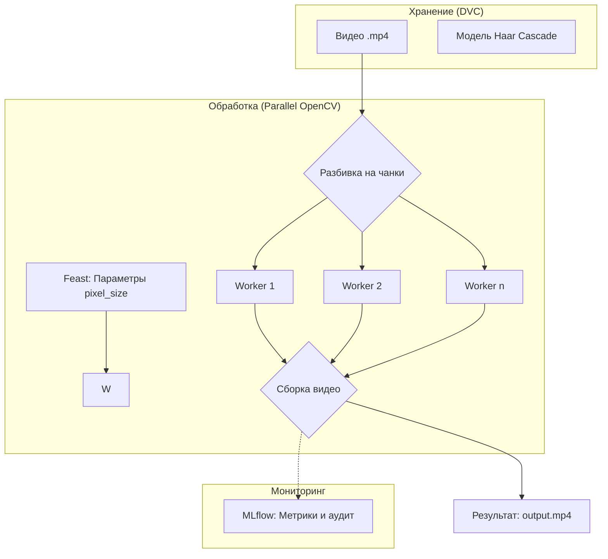

# Домашнее задание №5: Обеспечение воспроизводимости эксперимента (MLOps)

**Студент:** Ртищева Алена Сергеевна  
**Группа:** М08-501НД  
**Направление:** Наука о данных

---

## 🎯 Цель проекта
Построить минимальный, но полноценный MLOps-контур, обеспечивающий:
*   Воспроизводимость экспериментов и контроль версий (DVC).
*   Автоматизацию процесса обучения и оценки (DVC Pipelines).
*   Прозрачное логирование метрик и артефактов (MLflow).
*   Централизованное управление признаками (Feast Feature Store).

📂 Структура проекта
text
hw5_mlops_Rtishcheva_Alena/
├── .dvc/                       # Конфигурация и кэш системы версионирования данных
├── data/                       # Управление данными (версионируется через DVC)
│   ├── raw/                    # Исходные (сырые) данные
│   │   └── data.csv.dvc        # Указатель DVC на исходный датасет Titanic
│   └── processed/              # Результаты предобработки (train/test выборки)
├── src/                        # Исходный код (Pipeline stages)
│   ├── prepare.py              # Скрипт подготовки и разделения данных
│   └── train.py                # Скрипт обучения модели и интеграции с MLflow
├── feature_repo/               # Хранилище признаков (Feast Feature Store)
│   └── feature_repo/           # Определения сущностей и сервисов признаков
├── mlruns/                     # Локальное хранилище артефактов и логов MLflow
├── mlflow.db                   # База данных SQLite для трекинга экспериментов
├── marimo_test.py              # Реактивный блокнот (анализ и прототипирование)
├── marimo_test.py.htm          # Экспорт блокнота в статичный HTML-формат
├── dvc.yaml                    # Описание графа вычислений пайплайна
├── dvc.lock                    # Фиксация точных состояний данных и кода
├── params.yaml                 # Внешний конфигурационный файл гиперпараметров
├── Dockerfile                  # Инструкция для сборки образа системы
├── requirements.txt            # Список всех зависимостей проекта
├── model.pkl                   # Сохраненный артефакт обученной модели
├── Rtishcheva_AS_HW5.pdf       # Итоговый отчет о выполнении работы
└── README.md                   # Главная документация проекта

---

## 🚀 Как запустить проект

### 1. Клонирование и окружение
```bash
git clone https://github.com
cd hw5_mlops_Rtishcheva_Alena

python -m venv venv
# Активация (Windows):
venv\Scripts\activate
# Активация (Linux/Mac):
source venv/bin/activate

pip install -r requirements.txt
```

### 2. Управление данными и запуск пайплайна
```bash
# Получение данных через DVC
dvc pull

# Запуск полного цикла (prepare -> train)
dvc repro
```

### 3. Просмотр результатов (MLflow UI)
```bash
mlflow ui --backend-store-uri sqlite:///mlflow.db
```
Затем откройте в браузере: [http://localhost:5000](http://localhost:5000)

---

## 🛠 Краткое описание пайплайна (dvc.yaml)


| Стадия | Скрипт | Вход | Выход | Описание |
| :--- | :--- | :--- | :--- | :--- |
| **prepare** | `src/prepare.py` | `data/raw/data.csv` | `data/processed/` | Загрузка Titanic, сплит на train/test |
| **train** | `src/train.py` | `data/processed/` | `model.pkl` | Обучение LogisticRegression + логирование |

---

## 📝 Основные этапы выполнения

### Шаг 1. Marimo vs Colab
В ходе работы был осуществлен переход на реактивные блокноты **Marimo**. В отличие от Colab, Marimo решает проблему «скрытого состояния» за счет реактивности, хранит код в чистом `.py` формате (удобно для Git) и является готовым Python-скриптом для интеграции в продакшен.

### Шаг 2. Воспроизводимость (DVC & MLflow)
Реализовано разделение кода и данных. Git отслеживает только метафайлы `.dvc`, а сам датасет хранится вне репозитория. Интеграция с MLflow позволяет проводить аудит каждого запуска, отслеживая гиперпараметры (`params.yaml`) и метрики (`accuracy`).

### Шаг 3. Feature Store (Feast)
Внедрен Feast для управления признаками. Использован шаблон **PostgreSQL в Docker**, что позволило протестировать онлайн-хранилище в условиях, близких к реальным. Запущен эндпоинт `feast serve` для выдачи фич по API.

### Шаг 4. Обоснование готовности системы
Текущий проект является качественным **MVP**. Для полноценного «продакшена» системе не хватает:
1.  **Serving Layer:** Стабильного API (FastAPI) вне рамок Feast.
2.  **Monitoring:** Отслеживания качества модели и «дрифта» данных.
3.  **CI/CD:** Автоматических тестов и доставки.

### Шаг 5. Схема анонимизации лиц
Разработана архитектура системы размытия лиц на видео с использованием параллелизма данных.



---

## 🏁 Итоговый вывод
В проекте реализован полный MLOps-конвейер. Получен практический опыт работы с Docker, настройки связки PostgreSQL + Feast и автоматизации пайплайнов через DVC. Переход к инженерному подходу обеспечил стабильность и прозрачность процесса разработки ML-системы.